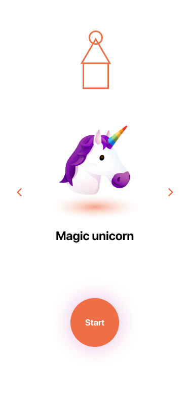
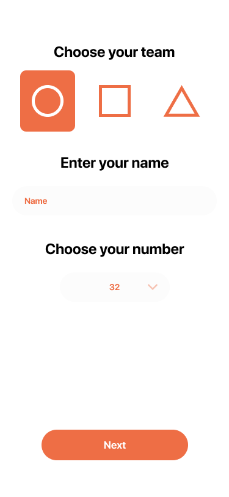
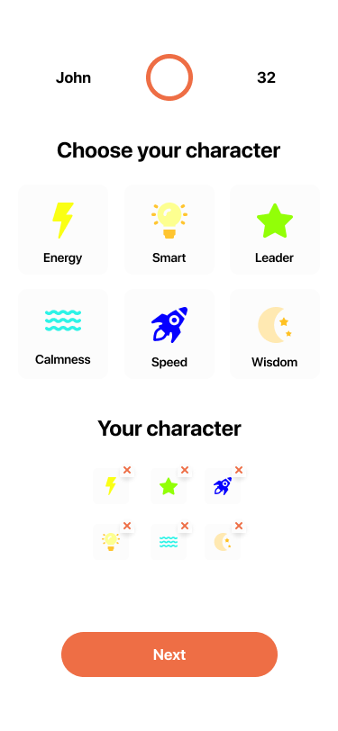

# React Native Test Project

Basic react native project based on typescript template

## Running

Clone the repository and run the following commands

### iOS

`yarn ios`

### Android

`yarn android`

## Project Structure

<pre>
📁 <b>src</b> - <i>contains JS-side sources</i>
┣ 📁 <b>assets</b> - <i>contains images, icons, fonts, and other assets</i>
┣ 📂 <b>components</b> - <i>contains all reusable components</i>
┃ ┣ 📂 <b>Button</b> - <i>example of a component</i>
┃ ┃ ┗ 📜 <b>index.tsx</b> - <i>contains the `Button` component implementation</i>
┃ ┗ 📜 <b>index.tsx</b> - <i>contains exports of all components</i>
┣ 📂 <b>navigation</b> - <i>contains navigation stacks and related items</i>
┃ ┗ 📜 <b>index.tsx</b> - <i>root navigation stack</i>
┣ 📂 <b>screens</b> - <i>contains screen components</i>
┃ ┣ 📂 <b>Initial</b> - <i>example of a screen</i>
┃ ┃ ┗ 📜 <b>index.tsx</b> - <i>contains the `Initial` screen implementation</i>
┃ ┗ 📜 <b>index.tsx</b> - <i>contains exports of all screens</i>
┗ 📂 <b>utils</b> - <i>contains utility functions</i>
</pre>

## Layouts

| Initial Screen               | Team Screen               | Character Screen               |
| ---------------------------- | ------------------------- | ------------------------------ |
|  |  |  |

## Task

You should create a React Native application that allows users to set up a character before starting a game. You should give to user an opportunity to choose an avatar, team, number, and characteristics for his protagonist and fill out his name. Follow the acceptance criteria below when completing the task.

#### Initial Screen

As a user, I want to choose an avatar from the list of available emojis, so that I can indicate myself in my team

- Show the app logo
- Show the avatar selector and provide an option to move left/right
- Display the `Start` button that navigates to the next screen
- The app remembers the choice but does not interact with the server

#### Team Screen

As a user, I want to choose the team, enter my name, and choose a number, so that other users will indicate me

- Display `Choose your team` block with an ability to choose one of three teams
- Show the input to fill out a `name`
- Provide an option to select a `number` from the dropdown list (numbers from 1 to 45)
- Display the `Next` button that navigates to the next screen
- The `Next` button must be non-active if `name` and/or `number` does not fill out
- The app sends data to the server

#### Character Screen

As a user, I want to choose my character, so that I can start a game

- Show the information filled out on a previous screen (`name`, `team`, `number`)
- Display a list of characteristics
- Provide an option for a user to choose an unlimited number of characteristics
- Show the list of chosen user characteristics
- Provide an option to remove any chosen previously characteristic(s)
- Display the `Done` button that navigates to the first screen and resets the state of the application
- The app sends data to the server

## Links

- [App layouts on Figma](https://www.figma.com/file/qzNAwyn3we2jN8vfqViY9y/Test)
- [API documentation](https://prodapi.ivorysoft.co/public-docs/)
